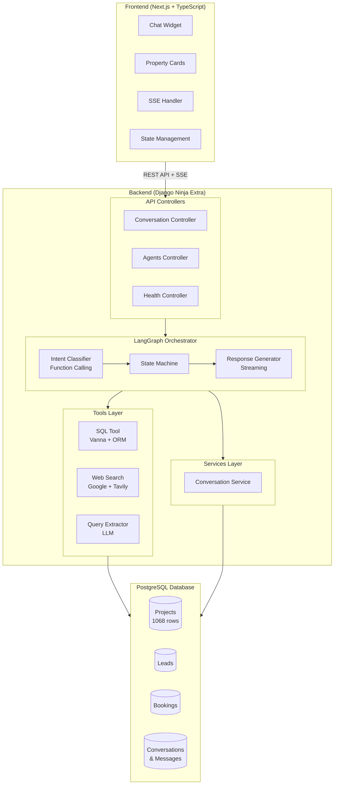
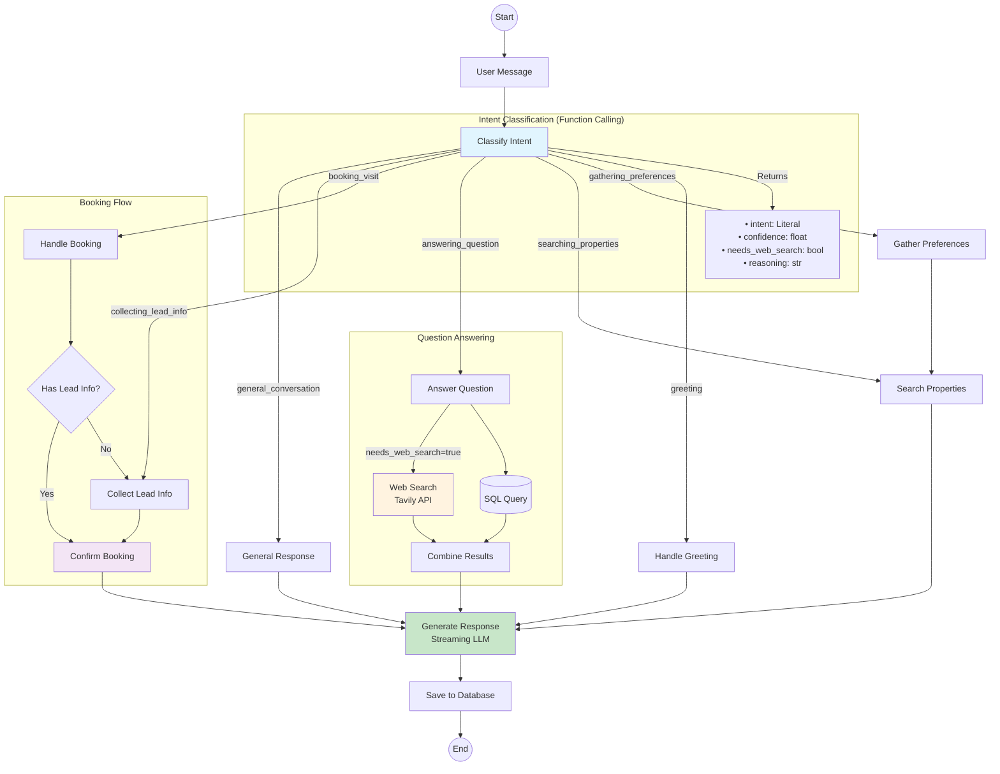
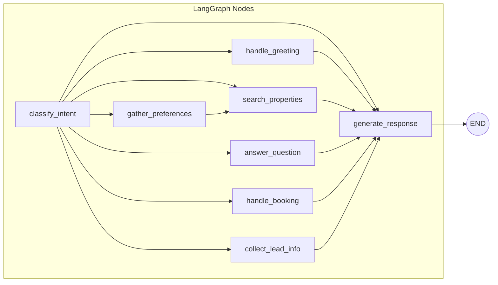
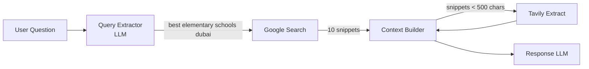
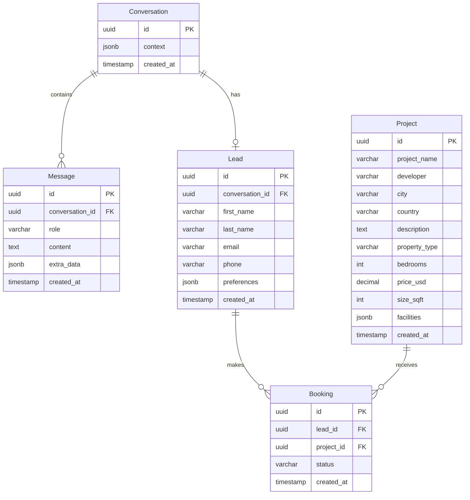

# PropLens - Property Sales Conversational AI Agent

A sophisticated conversational AI assistant for **Silver Land Properties**, built to help property buyers find their perfect home and schedule property viewings.

---

## Overview

PropLens is an AI-powered property sales assistant that:

- **Greets** users and understands their property preferences
- **Recommends** best-match properties from a database of 1000+ listings
- **Answers questions** about properties, amenities, and neighborhoods
- **Drives conversions** by guiding users to book property viewings
- **Collects leads** with contact information for follow-up

### Live Demo

- **Frontend**: [https://property-sales-agentic-assistant.vercel.app/](https://property-sales-agentic-assistant.vercel.app/)
- **Backend API**: [https://property-sales-agentic-assistant.onrender.com/api/docs](https://property-sales-agentic-assistant.onrender.com/api/docs)

---

## Features

| Feature | Description |
|---------|-------------|
| **Multi-turn Conversation** | Maintains context across the entire conversation |
| **Preference Extraction** | Extracts city, budget, bedrooms from natural language (strict, no hallucination) |
| **Property Search** | Text-to-SQL powered search with Django ORM fallback |
| **Web Search Integration** | Google Search + Tavily for schools, transport, neighborhood info |
| **Smart Query Extraction** | LLM extracts optimal search query from user message |
| **Property Interest Tracking** | Detects when user mentions specific property interest for CRM |
| **Lead Management** | Captures contact info with preferences and interested properties |
| **Booking System** | Records property visit bookings with full context |
| **Multilingual Support** | Responds in English and Indonesian |
| **Streaming Responses** | Real-time SSE streaming with smart scroll behavior |
| **Function Calling** | Reliable intent classification using OpenAI structured output |

---

## System Architecture



---

## LangGraph Agent Flow

The agent uses a **StateGraph** pattern with conditional routing based on intent classification:



### State Machine Nodes



### Intent Classification (Function Calling)

The agent uses OpenAI function calling for reliable intent classification:

```python
class IntentClassification(BaseModel):
    intent: Literal[
        "greeting",
        "gathering_preferences",
        "searching_properties",
        "answering_question",
        "booking_visit",
        "collecting_lead_info",
        "general_conversation"
    ]
    confidence: float           # 0.0 - 1.0
    reasoning: str              # Explanation for classification
    needs_web_search: bool      # Flag for external search
    interested_property: str    # Property user expresses interest in
```

### Property Interest Tracking

The system tracks properties users explicitly express interest in:
- "I like The OWO" -> `interested_property = "The OWO"`
- "Tell me about Damac Tower" -> `interested_property = "Damac Tower"`
- These are saved to `lead.preferences.interested_properties` for CRM follow-up

### Intent Types

| Intent | Trigger Examples | Action |
|--------|------------------|--------|
| `greeting` | "Hello", "Hi", "Halo" | Welcome message with preference questions |
| `gathering_preferences` | "Budget 500k", "3 bedrooms in Dubai" | Extract and store preferences |
| `searching_properties` | "Show me properties", "Find apartments" | Query database for matches |
| `answering_question` | "What schools nearby?", "Amenities?" | SQL + optional web search |
| `booking_visit` | "Yes, book it", "I want to visit", "Mau dong" | Initiate booking flow |
| `collecting_lead_info` | "John, john@email.com" | Extract contact details |
| `general_conversation` | Other queries | Contextual response |

### Web Search Architecture



**Flow:**
1. User asks: "before I choose, give me options of nearest elementary school"
2. LLM extracts optimal query: "best elementary schools dubai"
3. Google Search returns 10 results with snippets
4. Snippets are used as context for response generation
5. Tavily extracts full page content only if snippets are insufficient

---

## Tech Stack

### Backend
| Technology | Purpose |
|------------|---------|
| **Python 3.11** | Runtime |
| **Django 5.1** | Web framework |
| **Django Ninja Extra** | REST API with OOP controllers |
| **LangGraph 0.2** | Agent orchestration |
| **LangChain** | LLM integration |
| **OpenAI GPT-4o-mini** | Language model |
| **Vanna AI** | Text-to-SQL (with ChromaDB) |
| **Google Custom Search** | URL discovery for web search |
| **Tavily** | Content extraction from URLs |
| **PostgreSQL** | Database |
| **Gunicorn** | WSGI server |

### Frontend
| Technology | Purpose |
|------------|---------|
| **Next.js 14** | React framework |
| **TypeScript** | Type safety |
| **Tailwind CSS** | Styling |
| **React Markdown** | Message rendering |

### Infrastructure
| Technology | Purpose |
|------------|---------|
| **Docker** | Containerization |
| **Render** | Backend hosting |
| **Vercel** | Frontend hosting |

---

## Project Structure

```
proplens/
├── backend/
│   ├── config/
│   │   ├── settings.py          # Django settings
│   │   ├── urls.py              # URL routing
│   │   └── wsgi.py              # WSGI application
│   │
│   ├── proplens/
│   │   ├── agents/
│   │   │   ├── orchestrator.py  # LangGraph agent with function calling
│   │   │   ├── prompts.py       # System prompts
│   │   │   └── state.py         # Agent state definitions
│   │   │
│   │   ├── controllers/
│   │   │   ├── agents.py        # Chat endpoints (standard + streaming)
│   │   │   ├── conversations.py # Conversation CRUD
│   │   │   └── health.py        # Health check
│   │   │
│   │   ├── services/
│   │   │   └── conversation.py  # Business logic layer
│   │   │
│   │   ├── tools/
│   │   │   ├── sql_tool.py      # Vanna AI + Django ORM fallback
│   │   │   └── web_search.py    # Tavily web search
│   │   │
│   │   ├── management/
│   │   │   └── commands/
│   │   │       └── ingest_data.py # CSV data ingestion
│   │   │
│   │   ├── models.py            # Django ORM models
│   │   └── schemas.py           # Pydantic schemas
│   │
│   ├── tests/
│   │   ├── conftest.py          # Pytest fixtures
│   │   ├── test_models.py       # Django model tests
│   │   ├── test_services.py     # Service layer tests
│   │   ├── test_api.py          # API endpoint tests
│   │   ├── test_orchestrator.py # Agent logic tests
│   │   └── test_tools.py        # SQL/web search tests
│   │
│   ├── Dockerfile
│   └── requirements.txt
│
├── frontend/
│   ├── src/
│   │   ├── app/
│   │   │   └── page.tsx         # Main page
│   │   │
│   │   └── components/
│   │       └── ChatWidget.tsx   # Chat interface with SSE
│   │
│   ├── Dockerfile
│   └── package.json
│
├── docker-compose.yml
└── README.md
```

---

## API Documentation

### Base URL
- **Local**: `http://localhost:8000/api`
- **Production**: `https://property-sales-agentic-assistant.onrender.com/api`

### Interactive Documentation
Access Swagger UI at `/api/docs`

### Endpoints

#### Health Check
```http
GET /api/health
```

**Response:**
```json
{
  "status": "healthy",
  "app_name": "PropLens API",
  "version": "1.0.0",
  "vanna_available": true
}
```

---

#### Create Conversation
```http
POST /api/conversations
```

**Response:**
```json
{
  "id": "550e8400-e29b-41d4-a716-446655440000",
  "created_at": "2024-12-24T10:00:00Z"
}
```

---

#### Send Message (Standard)
```http
POST /api/agents/chat
Content-Type: application/json

{
  "conversation_id": "550e8400-e29b-41d4-a716-446655440000",
  "message": "I'm looking for a 2-bedroom apartment in Dubai under 500k"
}
```

**Response:**
```json
{
  "response": "I found some great options for you in Dubai...",
  "conversation_id": "550e8400-e29b-41d4-a716-446655440000",
  "recommended_projects": [
    {
      "id": "...",
      "project_name": "Marina Heights",
      "city": "Dubai",
      "price_usd": 450000,
      "bedrooms": 2,
      "property_type": "apartment"
    }
  ],
  "metadata": {
    "intent": "searching_properties",
    "booking_confirmed": false
  }
}
```

---

#### Send Message (Streaming)
```http
POST /api/agents/chat/stream
Content-Type: application/json

{
  "conversation_id": "550e8400-e29b-41d4-a716-446655440000",
  "message": "What schools are near Marina Heights?"
}
```

**Response (Server-Sent Events):**
```
data: {"type": "intent", "data": "answering_question"}

data: {"type": "content", "data": "Based on my search, "}

data: {"type": "content", "data": "there are several schools..."}

data: {"type": "done", "data": {"intent": "answering_question", "preferences": {...}}}
```

---

## Database Schema

### Entity Relationship Diagram



## Setup & Installation

### Prerequisites
- Docker & Docker Compose
- Python 3.11+
- Node.js 18+
- OpenAI API Key
- Tavily API Key (optional, for web search)

### Local Development with Docker

1. **Clone the repository**
   ```bash
   git clone https://github.com/yourusername/proplens.git
   cd proplens
   ```

2. **Create environment file**
   ```bash
   cp .env.example .env
   ```

3. **Edit `.env` with your API keys**
   ```env
   OPENAI_API_KEY=sk-proj-your-key-here
   TAVILY_API_KEY=tvly-your-key-here
   POSTGRES_HOST=postgres
   POSTGRES_PORT=5432
   POSTGRES_USER=proplens
   POSTGRES_PASSWORD=proplens123
   POSTGRES_DB=proplens
   ```

4. **Start with Docker Compose**
   ```bash
   docker compose up -d
   ```

5. **Access the application**
   - Frontend: http://localhost:3000
   - Backend API: http://localhost:8000/api/docs
   - Health Check: http://localhost:8000/api/health

### Environment Variables

| Variable | Required | Description |
|----------|----------|-------------|
| `OPENAI_API_KEY` | Yes | OpenAI API key for GPT-4o-mini |
| `TAVILY_API_KEY` | No | Tavily API key for content extraction |
| `GOOGLE_SEARCH_API_KEY` | No | Google Custom Search API key |
| `GOOGLE_SEARCH_CSE_ID` | No | Google Custom Search Engine ID |
| `GOOGLE_SEARCH_ENABLED` | No | Set to "true" to enable Google Search |
| `DATABASE_URL` | Yes* | PostgreSQL connection string |
| `POSTGRES_HOST` | Yes* | Database host |
| `POSTGRES_PORT` | Yes* | Database port (default: 5432) |
| `POSTGRES_USER` | Yes* | Database user |
| `POSTGRES_PASSWORD` | Yes* | Database password |
| `POSTGRES_DB` | Yes* | Database name |
| `ALLOWED_HOSTS` | No | Comma-separated allowed hosts |

*Either `DATABASE_URL` or individual `POSTGRES_*` variables required

---

## Testing

### Run All Tests
```bash
cd backend
pip install -r requirements-test.txt
pytest tests/ -v
```

### Run with Coverage
```bash
pytest --cov=proplens --cov-report=html
```

### Test Categories
```bash
# Model tests
pytest tests/test_models.py -v

# Service tests
pytest tests/test_services.py -v

# API endpoint tests
pytest tests/test_api.py -v

# Agent orchestrator tests
pytest tests/test_orchestrator.py -v

# Tool tests (SQL, Web Search)
pytest tests/test_tools.py -v
```

### Sample Test Conversation

```python
def test_full_booking_flow():
    """Test complete conversation from greeting to booking."""

    # 1. Create conversation
    response = client.post("/api/conversations")
    conv_id = response.json()["id"]

    # 2. Send greeting
    response = client.post("/api/agents/chat", json={
        "conversation_id": conv_id,
        "message": "Hello"
    })
    assert "Silvy" in response.json()["response"]

    # 3. Provide preferences
    response = client.post("/api/agents/chat", json={
        "conversation_id": conv_id,
        "message": "I need a 2-bedroom apartment in Dubai under 500k"
    })
    assert len(response.json()["recommended_projects"]) > 0

    # 4. Ask question with web search
    response = client.post("/api/agents/chat", json={
        "conversation_id": conv_id,
        "message": "What schools are nearby?"
    })
    assert "school" in response.json()["response"].lower()

    # 5. Book visit with lead info
    response = client.post("/api/agents/chat", json={
        "conversation_id": conv_id,
        "message": "Yes book it! I'm John Doe, john@example.com"
    })
    assert response.json()["metadata"]["booking_confirmed"] == True
```

---

## Design Decisions

### 1. Why Django Ninja Extra?

**Requirement**: Challenge specified Django Ninja + Ninja Extra with OOP controllers

**Benefits**:
- Class-based controllers for better organization
- Pydantic schemas for validation
- Auto-generated OpenAPI documentation
- Django ORM for robust database handling

### 2. Why LangGraph over LangChain Agents?

**Benefits**:
- **Explicit state machine**: Clear flow control and easier debugging
- **Conditional routing**: Intent-based branching with `add_conditional_edges`
- **Streaming support**: Built-in async generator support for SSE
- **State persistence**: Easy context management across turns
- **Visualizable**: Graph structure can be exported and visualized

### 3. Why Function Calling for Intent Classification?

**Problem**: Regex-based parsing of LLM output is unreliable

**Solution**: OpenAI function calling with Pydantic schema

```python
class IntentClassification(BaseModel):
    intent: Literal[...]  # Guaranteed valid intent
    confidence: float     # Know when to fallback
    reasoning: str        # Explainability
    needs_web_search: bool # LLM decides when to search
```

**Benefits**:
- Guaranteed structured output
- No regex parsing needed
- Confidence scores for fallback logic
- Web search flag determined by LLM context

### 4. Why Vanna AI + Django ORM Fallback?

**Vanna AI**:
- Natural language to SQL
- Learns from query patterns (ChromaDB)
- Handles complex queries

**Django ORM Fallback**:
- Works without OPENAI_API_KEY
- Reliable for simple filters
- Better error handling

### 5. Why PostgreSQL?

- **Production-ready**: Better than SQLite for deployed apps
- **JSONB support**: Flexible context and preferences storage
- **Concurrent connections**: Handles multiple users
- **Render integration**: Easy database provisioning

### 6. Why GPT-4o-mini?

- **Cost-effective**: ~10x cheaper than GPT-4
- **Fast**: Lower latency for streaming responses
- **Capable**: Sufficient for property recommendations
- **Function calling**: Full support for structured outputs

---

## Sample Conversations

### English Flow
```
User: Hello
Silvy: Hello! I'm Silvy, your property assistant at Silver Land Properties.
      What city are you interested in?

User: I'm looking for something in Dubai, budget around 500k, 2 bedrooms
Silvy: I found some great options for you:
      • Marina Heights: $450,000, 2 bed, Dubai
      • Palm Residences: $480,000, 2 bed, Dubai
      Would you like to book a visit?

User: What schools are near Marina Heights?
Silvy: Based on my research, there are several schools near Marina Heights...

User: Yes, book Marina Heights. I'm John, john@email.com
Silvy: Booking confirmed! Our representative will contact you at john@email.com.
```

### Indonesian Flow
```
User: Halo
Silvy: Halo! Saya Silvy, asisten properti di Silver Land Properties.
      Kota mana yang Anda minati?

User: Saya cari apartemen di Jakarta budget 1 miliar
Silvy: Saya menemukan beberapa pilihan untuk Anda di Jakarta...

User: Mau dong yang pertama
Silvy: Baik! Boleh saya minta nama dan email untuk booking?

User: Budi, budi@email.com
Silvy: Booking berhasil! Tim kami akan menghubungi Anda di budi@email.com.
```

---

## License

MIT License

---
